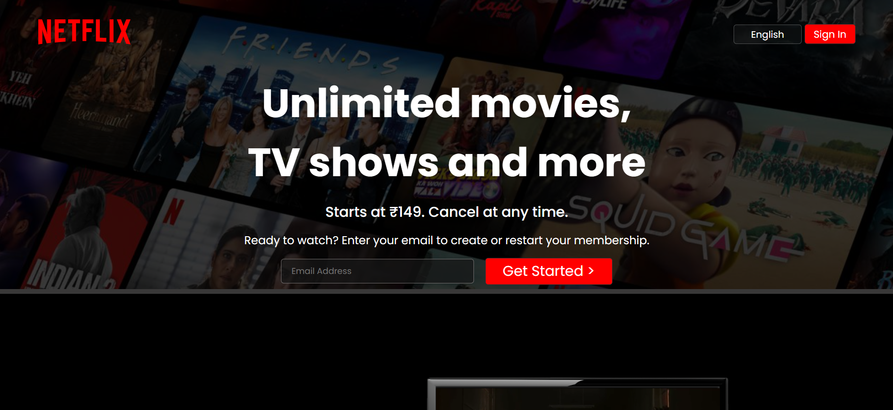
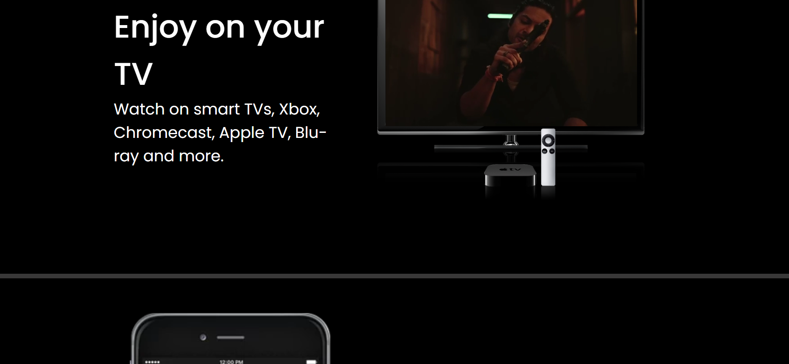
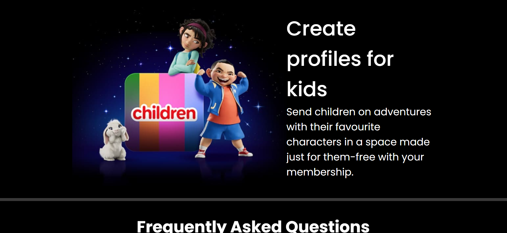
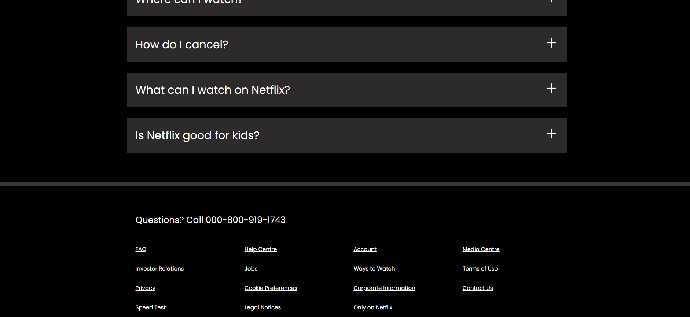
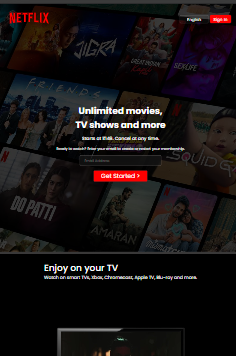
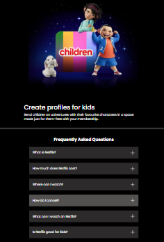
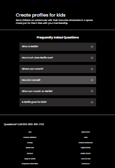

# Netflix Landing Page Clone

## Description

This project is a clone of Netflix's landing page, designed to replicate the look and feel of the original. It features a beautiful UI and is fully responsive, ensuring a seamless experience across multiple devices. The project is currently built using HTML and CSS, with plans to incorporate JavaScript for enhanced functionality.

---

## Features

- Stunning and modern user interface.
- Fully responsive design for compatibility with desktops, tablets, and smartphones.
- Replicates the layout and styling of Netflix's official landing page.

---

## Previews









---

## Requirements

The project currently uses:

- **HTML** for structure.
- **CSS** for styling.

### Future Enhancements

- Add **JavaScript** for dynamic interactions and enhanced functionality.

---

## Installation

1. Clone the repository:
   ```bash
   git clone https://github.com/Coden-inja/Netflix-Clone.git
   ```
2. Navigate to the project directory:
   ```bash
   cd Netflix-Clone
   ```
3. Open the `index.html` file in your browser to view the project.

---

## Usage

- Open the landing page in a browser to view the responsive design.
- Explore the layout and UI to see the resemblance to Netflix's original design.

---

## Contributing

Contributions are welcome! To contribute:

1. Fork the repository.
2. Create a new branch:
   ```bash
   git checkout -b feature-name
   ```
3. Make your changes and commit them:
   ```bash
   git commit -m "Add your message here"
   ```
4. Push to your branch:
   ```bash
   git push origin feature-name
   ```
5. Open a pull request.

---

## License

This project is licensed under the MIT License. You are free to use, modify, and distribute this project, provided that proper credit is given to the original author. For more details, refer to the [LICENSE](./LICENSE) file.

---

## LICENSE

```plaintext
MIT License

Copyright (c) 2025 Coden-inja

Permission is hereby granted, free of charge, to any person obtaining a copy
of this software and associated documentation files (the "Software"), to deal
in the Software without restriction, including without limitation the rights
to use, copy, modify, merge, publish, distribute, sublicense, and/or sell
copies of the Software, and to permit persons to whom the Software is
furnished to do so, subject to the following conditions:

The above copyright notice and this permission notice shall be included in all
copies or substantial portions of the Software.

THE SOFTWARE IS PROVIDED "AS IS", WITHOUT WARRANTY OF ANY KIND, EXPRESS OR
IMPLIED, INCLUDING BUT NOT LIMITED TO THE WARRANTIES OF MERCHANTABILITY,
FITNESS FOR A PARTICULAR PURPOSE AND NONINFRINGEMENT. IN NO EVENT SHALL THE
AUTHORS OR COPYRIGHT HOLDERS BE LIABLE FOR ANY CLAIM, DAMAGES OR OTHER
LIABILITY, WHETHER IN AN ACTION OF CONTRACT, TORT OR OTHERWISE, ARISING FROM,
OUT OF OR IN CONNECTION WITH THE SOFTWARE OR THE USE OR OTHER DEALINGS IN THE
SOFTWARE.
```
